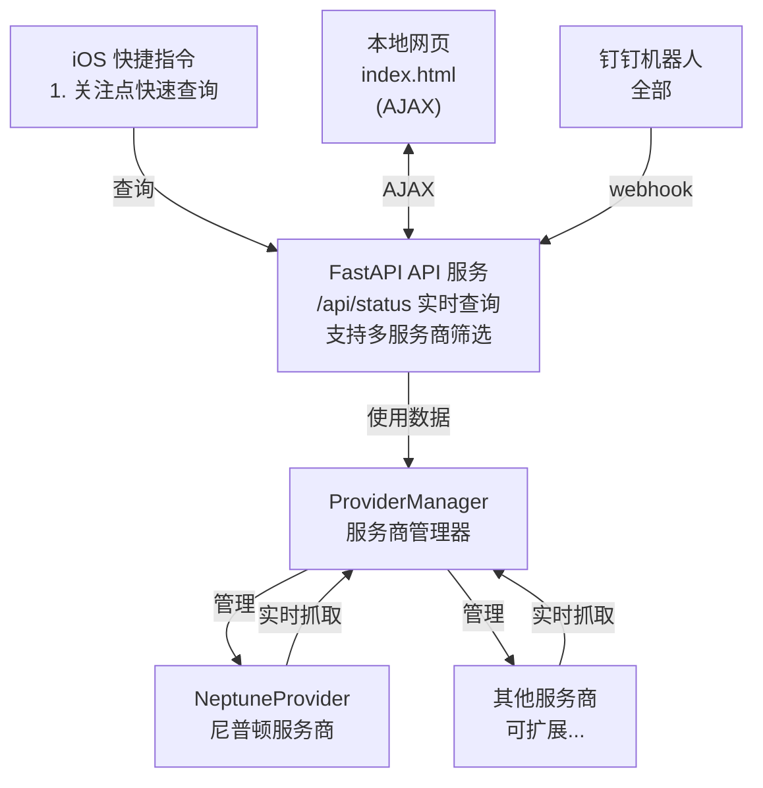

# ZJU Charger

> 基于 FastAPI 的浙江大学充电桩状态查询系统，支持多个充电桩服务商（当前支持尼普顿），实现充电桩状态查询、前端关注列表、钉钉机器人交互等功能。

免责声明：本项目仅用于个人学习交流，不得用于商业用途。使用本项目所造成的任何后果，由使用者自行承担。

## 系统架构



所有查询来源（网页、钉钉、GitHub Action）都调用统一 API 和 ProviderManager，逻辑完全不重复。系统采用多服务商架构，支持同时显示和筛选多个服务商的充电桩数据。

## 功能特性

- [x] 异步并发抓取，大幅提升查询速度
- [x] FastAPI 统一 API 接口
- [x] 多服务商架构支持，可同时显示和筛选多个服务商数据
- [x] 网页地图可视化（Leaflet）
- [x] 支持高德地图、OpenStreetMap 三种地图
- [x] 服务商筛选功能（前端下拉框）
- [x] 校区筛选功能（玉泉、紫金港）
- [x] 前端关注列表功能（使用 localStorage，支持 devid+provider 查询）
- [ ] 使用 ChinaTMSProviders 插件，支持多种地图
- [ ] 钉钉机器人交互（全部）
- [ ] GitHub Action 自动定时抓取
- [ ] GitHub Pages 静态部署支持


## 项目结构

```text
project/
├── fetcher/
│   ├── provider_base.py      # 服务商抽象基类
│   ├── provider_manager.py   # 服务商管理器
│   ├── providers/
│   │   └── neptune.py        # 尼普顿服务商实现
│   └── fetch.py              # 统一抓取逻辑（异步，已废弃）
├── server/
│   ├── api.py                # FastAPI 主服务
│   ├── storage.py            # 数据存储管理
│   ├── config.py             # 环境变量配置（支持服务商配置）
│   └── station_loader.py     # 站点信息加载器
├── ding/
│   ├── bot.py                # 钉钉机器人封装
│   ├── webhook.py            # 钉钉 webhook 路由
│   └── commands.py           # 命令解析和执行
├── web/                      # 前端文件
│   ├── index.html            # 地图 + 列表页面（支持服务商筛选）
│   ├── script.js             # 前端逻辑（支持多服务商）
│   └── style.css             # 样式文件
├── data/                     # 数据目录
│   ├── latest.json           # 最新状态缓存（统一格式，包含 provider_id）
│   └── stations.json          # 站点信息（包含 campus 字段）
├── script/                   # iOS 快捷指令
│   ├── README.md             # 快捷指令使用说明
│   └── *.shortcut            # 快捷指令文件
├── run_server.py             # 服务器启动脚本
└── requirements.txt         # 依赖库
```

## 多服务商架构

### 架构设计

系统采用多服务商架构，支持同时接入多个充电桩服务商：

1. **ProviderBase** (`fetcher/provider_base.py`): 服务商抽象基类，定义统一接口
2. **ProviderManager** (`fetcher/provider_manager.py`): 服务商管理器，负责注册、管理和调用所有服务商
3. **Provider 实现** (`fetcher/providers/`): 各服务商的具体实现

### 数据结构

#### 统一站点数据结构

每个站点数据包含以下字段：

```python
{
    "provider_id": "neptune",      # 服务商标识
    "provider_name": "尼普顿",     # 服务商显示名称
    "id": "站点唯一ID",
    "name": "站点名称",
    "devids": [devid1, devid2],
    "lat": 30.27,
    "lon": 120.12,
    "free": 5,
    "total": 10,
    "used": 4,
    "error": 1,
    "campus": 2143  # 校区ID（原 areaid，已统一改为 campus）
}
```

#### 数据存储格式

`latest.json` 格式：

```json
{
    "updated_at": "2025-01-01T00:00:00+08:00",
    "stations": [
        {
            "provider_id": "neptune",
            "provider_name": "尼普顿",
            "id": "站点1",
            "name": "站点名称1",
            "campus": 2143,
            ...
        }
    ]
}
```

## 快速开始

### 1. 安装依赖

```bash
pip install -r requirements.txt
```

### 2. 抓取 OpenID

为了识别用户，每个用户针对每个公众号或小程序等应用会产生一个安全的 OpenID

- 在小程序中，openID 是小程序的普通用户的一个唯一的标识，只针对当前的小程序有效
- 同理在公众号中 openID 是公众号的普通用户的一个唯一的标识，只针对当前的公众号有效

**建议收集多个 openID**：为了防止账号被封禁，建议使用多个 openID 进行轮询。你可以：
- 使用不同的设备抓取不同的 openID
- 使用不同的微信账号抓取不同的 openID
- 每个供应商可以配置多个 openID，系统会自动轮询使用

下面以 iOS 系统为例，展示如何抓取 OpenID。

1. 下载[Stream](https://apps.apple.com/us/app/stream/id1312141691?l=zh-Hans-CN)
2. 打开 Stream，点击开始抓包
3. 进入尼普顿小程序，点击充电桩服务 - 附近
4. 回到 Stream，点击结束抓包
5. 点击抓包历史，找到尼普顿小程序的请求，点击请求头，找到 openid 参数
6. 复制 openid 参数值，即为 OpenID

重复以上步骤，使用不同设备或账号收集多个 openID。

### 3. 配置 OpenID

有两种方式配置 openID：

#### 方式一：使用 secret.json（推荐，支持轮询）

使用交互式脚本添加 openID：

```bash
python add_openid.py
```

脚本会引导你：
1. 选择供应商（如 neptune）
2. 输入 openID
3. 自动保存到 `secret.json`

你也可以手动创建 `secret.json` 文件（项目根目录）：

```json
{
  "neptune": ["openid1", "openid2", "openid3"]
}
```

**轮询机制**：每次后端定时抓取时，系统会自动切换到下一个 openID，有效防止账号被封禁。

#### 方式二：使用环境变量（向后兼容）

编辑 `.env` 文件：

```env
# 微信 openId（必需，如果未配置 secret.json）
OPENID=your_openid_here

# 钉钉机器人配置（可选）
DINGTALK_WEBHOOK=https://oapi.dingtalk.com/robot/send?access_token=xxx
DINGTALK_SECRET=your_secret_here

# API 服务器配置
API_HOST=0.0.0.0 # 服务器地址
API_PORT=8000 # 服务器端口

# 数据抓取配置
FETCH_INTERVAL=60 # 前端自动刷新间隔（秒），默认60秒
BACKEND_FETCH_INTERVAL=300 # 后端定时抓取间隔（秒），默认300秒（5分钟）
```

**优先级**：如果同时配置了 `secret.json` 和环境变量，系统会优先使用 `secret.json` 中的配置。

### 4. 更新站点信息（可选）

站点信息存储在 `data/stations.json` 中。首次运行或需要更新站点信息时，运行：

```bash
python server/update_stations.py
```

**注意**：服务器启动时不会自动更新站点信息，需要手动运行此脚本。

### 5. 运行服务器（前后端一体）

```bash
python run_server.py
```

访问 `http://localhost:8000/web/` 查看效果

### 6. 前端关注列表功能

前端支持关注列表功能，数据存储在浏览器的 localStorage 中：

- **添加关注**：点击站点列表中的心形图标（🤍）即可添加关注
- **取消关注**：再次点击已关注的站点的心形图标（❤️）即可取消关注
- **数据存储**：关注列表数据存储在浏览器的 localStorage 中，不会上传到服务器
- **查询方式**：前端通过 `devid+provider` 参数调用 `/api/status` API 来获取关注站点的状态

### Docker 部署（TODO: 待实现）

## 许可证

见 LICENSE 文件

## 贡献

欢迎提交 Issue 和 Pull Request！

## 致谢

- 感谢 [cyc-987/Charge-in-ZJU: 浙大充电桩查询](https://github.com/cyc-987/Charge-in-ZJU) 的原作者 [@cyc-987](https://github.com/cyc-987)，为该项目提供了基础功能和灵感。
- 使用 [leaflet-echarts](https://github.com/wandergis/leaflet-echarts) 提供了地图可视化功能。
- 使用 [wandergis/coordtransform](https://github.com/wandergis/coordtransform) 提供了百度坐标（BD09）、国测局坐标（火星坐标，GCJ02）、和 WGS84 坐标系之间的转换函数，解决坐标偏移的问题。
- 使用 [htoooth/Leaflet.ChineseTmsProviders](https://github.com/htoooth/Leaflet.ChineseTmsProviders/tree/master) 提供了多种地图支持。
- 使用 [Tailwind CSS](https://tailwindcss.com/) 样式库。
