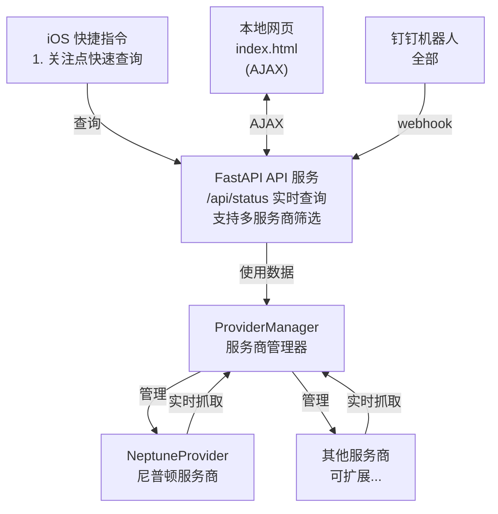
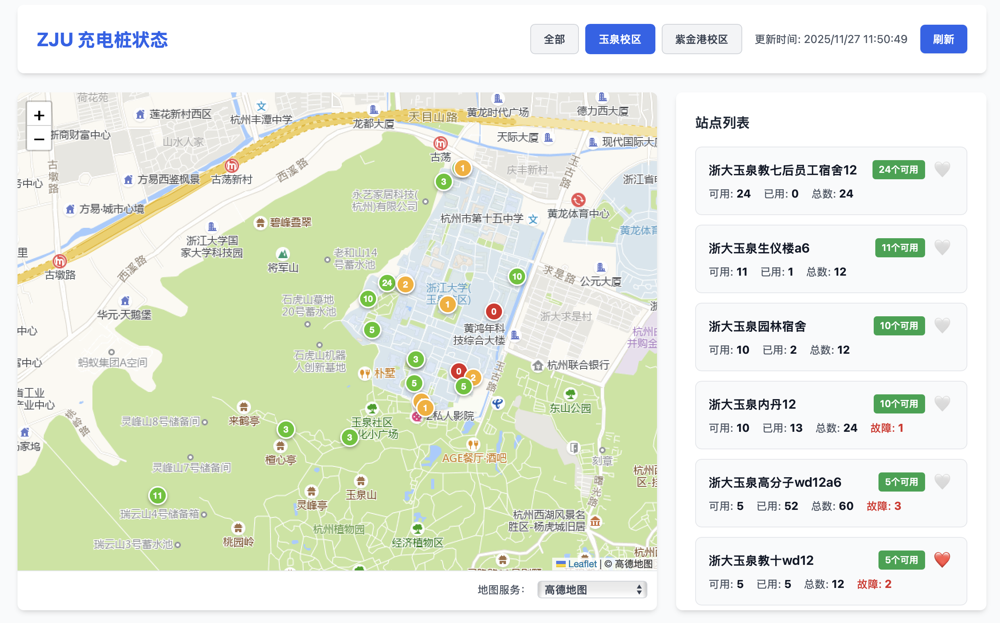

# ZJU Charger

      

[](https://github.com/Phil-Fan/ZJU-Charger/actions/workflows/markdown-check.yml) [](https://github.com/Phil-Fan/ZJU-Charger/actions/workflows/python-check.yml) [](https://github.com/Phil-Fan/ZJU-Charger/actions/workflows/pages/pages-build-deployment)

> 基于 FastAPI 的浙江大学充电桩状态查询系统，支持多个充电桩服务商（当前支持尼普顿），实现充电桩状态查询、前端关注列表、钉钉机器人交互等功能。

免责声明：本项目仅用于个人学习交流，不得用于商业用途。使用本项目所造成的任何后果，由使用者自行承担。

## 系统架构



所有查询来源（网页、钉钉、GitHub Action）都调用统一 API 和 ProviderManager，逻辑完全不重复。系统采用多服务商架构，支持同时显示和筛选多个服务商的充电桩数据。

## 功能特性

- [x] 异步并发抓取
- [x] FastAPI 统一 API 接口
- [x] 多服务商架构支持，可同时显示和筛选多个服务商数据
- [x] 网页地图可视化（Leaflet）；支持高德地图、OpenStreetMap；支持服务商筛选功能（前端下拉框）；支持校区筛选功能（玉泉、紫金港）
- [x] 前端关注列表功能
- [ ] 钉钉机器人交互

网页效果：



快捷指令效果：


钉钉机器人效果：

## 最小抓取示例

详见 [get_status.py](./get_status.py)。

```shell
python get_status.py --address 50359163
```

## 项目结构

```text
project/
├── fetcher/
│   ├── provider_base.py      # 服务商抽象基类
│   ├── provider_manager.py   # 服务商管理器
│   ├── providers/
│   │   └── neptune.py        # 尼普顿服务商实现
│   └── fetch.py              # 统一抓取逻辑（异步，已废弃）
├── server/
│   ├── api.py                # FastAPI 主服务
│   ├── storage.py            # 数据存储管理
│   ├── config.py             # 环境变量配置（支持服务商配置）
│   └── station_loader.py     # 站点信息加载器
├── ding/
│   ├── bot.py                # 钉钉机器人封装
│   ├── webhook.py            # 钉钉 webhook 路由
│   └── commands.py           # 命令解析和执行
├── web/                      # 前端文件
│   ├── index.html            # 地图 + 列表页面（支持服务商筛选）
│   ├── script.js             # 前端逻辑（支持多服务商）
│   └── style.css             # 样式文件
├── data/                     # 数据目录
│   ├── latest.json           # 最新状态缓存（统一格式，包含 provider_id）
│   └── stations.json          # 站点信息（包含 campus 字段）
├── script/                   # iOS 快捷指令
│   ├── README.md             # 快捷指令使用说明
│   └── *.shortcut            # 快捷指令文件
├── run_server.py             # 服务器启动脚本
└── requirements.txt         # 依赖库
```

## 文档

详细的文档请查看 [docs](./docs/) 目录：

- [快速开始](./docs/01-quick-start.md) - 快速上手指南
- [Web 介绍与部署](./docs/02-web-deployment.md) - 前端功能说明和部署指南
- [Server 端部署](./docs/03-server-deployment.md) - 后端服务器部署指南
- [Fetcher 文档](./docs/04-fetcher.md) - 如何添加新服务商、更新站点信息
- [钉钉机器人文档](./docs/05-dingbot.md) - 钉钉机器人配置和使用
- [Script 快捷指令文档](./docs/06-script-shortcuts.md) - iOS 快捷指令使用指南

## 许可证

使用 GPLv3 许可证，见 [LICENSE](./LICENSE) 文件

## 贡献

欢迎提交 Issue 和 Pull Request！

请查看：

- [行为准则](./CODE_OF_CONDUCT.md)
- [贡献指南](./CONTRIBUTING.md)
- [Issue 模板](./.github/ISSUE_TEMPLATE/)
- [Pull Request 模板](./.github/pull_request_template.md)


## 致谢

- 感谢 [cyc-987/Charge-in-ZJU: 浙大充电桩查询](https://github.com/cyc-987/Charge-in-ZJU) 的原作者 [@cyc-987](https://github.com/cyc-987)，为该项目提供了基础功能和灵感。
- 使用 [leaflet-echarts](https://github.com/wandergis/leaflet-echarts) 提供了地图可视化功能。
- 使用 [wandergis/coordtransform](https://github.com/wandergis/coordtransform) 提供了百度坐标（BD09）、国测局坐标（火星坐标，GCJ02）、和 WGS84 坐标系之间的转换函数，解决坐标偏移的问题。
- 使用 [htoooth/Leaflet.ChineseTmsProviders](https://github.com/htoooth/Leaflet.ChineseTmsProviders/tree/master) 提供了多种地图支持。
- 使用 [Tailwind CSS](https://tailwindcss.com/) 样式库。
- 使用 [minima](https://github.com/jekyll/minima) 主题生成项目文档。
- 使用 [Caddy](https://caddyserver.com/) 提供 HTTPS 证书与反向代理服务。
- 使用 [huacnlee/autocorrect](https://github.com/huacnlee/autocorrect/), [DavidAnson/markdownlint-cli2-action](https://github.com/DavidAnson/markdownlint-cli2-action) 与 [gaurav-nelson/github-action-markdown-link-check](https://github.com/gaurav-nelson/github-action-markdown-link-check) 对 Markdown 文档进行自动化检查。
- 使用 [black](https://github.com/psf/black) 与 [lgeiger/black-action](https://github.com/lgeiger/black-action) 对 Python 代码进行自动化格式检查。
- 使用 [Star History](https://star-history.com/) 提供了 star 历史统计。

感谢所有贡献者！


