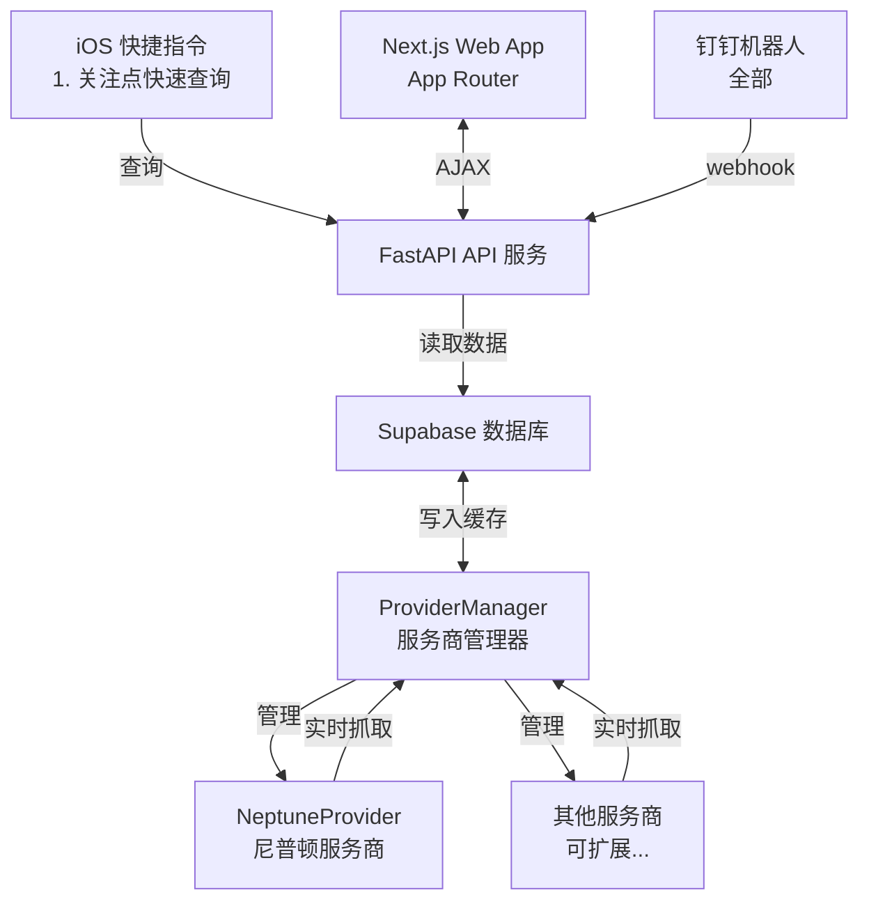

# 🔋 𝐙𝐉𝐔 𝐂𝐡𝐚𝐫𝐠𝐞𝐫

      

[](https://github.com/Phil-Fan/ZJU-Charger/actions/workflows/markdown-check.yml) [](https://github.com/Phil-Fan/ZJU-Charger/actions/workflows/python-check.yml) [](https://github.com/Phil-Fan/ZJU-Charger/actions/workflows/pages/pages-build-deployment)

你是否也曾骑着没电的小龟，慢吞吞地骑到充电桩，却发现一个空余的桩位都没有？😫
你是否也曾被充电桩服务商离谱的 UI 界面与复杂的查询接口所困扰？😠

ZJU Charger 基于 FastAPI 开发，瞄准**校内充电桩不好找、供应商入口不一、使用状态查询不便**三大痛点，为你提供一个简洁、易用、扩展性强的充电桩查询方案。

目前支持网站在线分校区、分服务商查询（普查）、iOS 快捷指令查询特定站点状态（精准查）、钉钉 Webhook 机器人等功能。

访问 [https://charger.philfan.cn/](https://charger.philfan.cn/) 查看效果。

> **免责声明**：本项目仅用于学习交流，不得用于商业盈利与非法用途。使用本项目所造成的任何后果，由使用者自行承担，作者不承担任何责任。请遵守相关法律法规。

## 功能特性

-### 前端功能

- [x] Next.js App Router + TypeScript + shadcn/ui（Supabase 主题）重建 SPA，Header/地图/列表/关注等模块拆分为可复用组件，全部托管在 `frontend/`。
- [x] Apache ECharts + `echarts-extension-amap` 继续渲染高德底图，绿/橙/红三色编码空闲、紧张、故障状态，并与校区摘要保持联动。
- [x] 校区/服务商筛选、暗黑主题、自动刷新、夜间提示与关注列表通过 hooks + localStorage 实现，状态统一由 Next 客户端组件驱动。
- [x] 新增实时定位 watch 控件：开启后持续追踪浏览器坐标、绘制用户标记，可手动停止并在权限被拒绝或浏览器不支持时弹出 toast。
- [x] 双击标记打开导航卡片、列表进度条、校区摘要等交互保持不变，同时提供 shadcn toast/alert、404/503/504 Next.js 页面等一致体验。

### 后端功能

- [x] 后台定时抓取任务，自动更新缓存
- [x] Supabase 数据库支持，记录历史使用情况数据（可选）
- [x] FastAPI 统一 API 接口，使用 slowapi 实现接口限流功能
- [x] 多服务商架构支持，可同时异步抓取多个服务商的充电桩数据（目前支持了尼普顿服务商）

### 快捷指令

[ZJU Charger.shortcut](https://www.icloud.com/shortcuts/1545aeee457046dbacba42ef0ab6285d)

支持快速查询关注的几个站点的状态，并可以添加到主屏幕，方便随时查看。
操作步骤详见 [Script 快捷指令文档](./docs/06-script-shortcuts.md#使用方法)。


### 钉钉 Webhook 机器人


## 文档

详细的文档请查看 [docs](./docs/) 目录：

- [快速开始](./docs/01-quick-start.md) - 快速上手指南
- [Web 介绍与部署](./docs/02-web-deployment.md) - 前端功能说明和部署指南
- [Server 端部署](./docs/03-server-deployment.md) - 后端服务器部署指南
- [Fetcher 文档](./docs/04-fetcher.md) - 如何添加新服务商、更新站点信息
- [钉钉机器人文档](./docs/05-dingbot.md) - 钉钉机器人配置和使用
- [Script 快捷指令文档](./docs/06-script-shortcuts.md) - iOS 快捷指令使用指南
- [Supabase 数据库架构](./docs/07-supabase-schema.md) - Supabase 数据库表结构和使用说明
- [API 参考](./docs/08-api.md) - 后端 REST API 描述与示例

## Web 部署

1. 安装依赖并准备环境变量：

   ```bash
   cd frontend
   pnpm install
   cp .env.local.example .env.local  # （如不存在可自行创建）
   # 写入 NEXT_PUBLIC_AMAP_KEY=你的高德 JS SDK Key
   # 可选 NEXT_PUBLIC_API_BASE=https://your-api-domain 指向 FastAPI
   ```

2. 本地调试：`pnpm dev`（默认端口 3000），Next.js 会以 App Router 形式渲染。需要实时 API 时可在本地同时运行 FastAPI 或设置 `NEXT_PUBLIC_API_BASE` 指向远端。

3. 生产构建：`pnpm build && pnpm start` 验证输出；若使用静态托管，可运行 `pnpm export` 或将 `.next` 交由自建 Node 服务，FastAPI 依旧只提供 `/api/*`。

4. 本仓库的 shadcn 组件已按照 Supabase 主题初始化，如需追加组件可运行 `pnpm dlx shadcn@latest add <component>`（若要重新拉取 Supabase 主题可执行 `pnpm dlx shadcn@latest add https://tweakcn.com/r/themes/supabase.json`，需确保网络可访问该源）。

**环境变量注入高德 Key 与 API 域名**

- Next.js 会自动加载 `.env*` 文件，凡是以 `NEXT_PUBLIC_` 前缀命名的变量会被编译到浏览器端，因此必须使用 `NEXT_PUBLIC_AMAP_KEY` 和 `NEXT_PUBLIC_API_BASE`。
- 本地开发建议创建 `frontend/.env.local`：

  ```ini
  NEXT_PUBLIC_AMAP_KEY=dev-gaode-key
  NEXT_PUBLIC_API_BASE=http://localhost:8000
  ```

  运行 `pnpm dev` 时会注入这些值，前端请求 `http://localhost:8000/api/*`，地图加载本地 Key。
- 远程部署（Docker、Caddy、Vercel 等）只需在环境中设置同名变量，例如 `.env.production` 或部署平台的环境变量面板：

  ```ini
  NEXT_PUBLIC_AMAP_KEY=prod-gaode-key
  NEXT_PUBLIC_API_BASE=https://charger.philfan.cn
  ```

  执行 `pnpm build` 时 Next.js 会将其编译进静态产物。
- 如果未设置 `NEXT_PUBLIC_API_BASE`，客户端会直接调用相对路径 `/api/*`，适用于前后端同域部署；只在需要跨域访问（如本地连远程 API）时赋值。

## 最小抓取示例

可以使用 `fetcher/minium_get_status.py` 进行简单的状态查询：

```shell
python fetcher/minium_get_status.py --address 50359163
```

或者直接使用 API 接口：

```shell
curl http://localhost:8000/api/status?id=29e30f45
```

## 系统架构

在开发层面，目标实现高内聚、低耦合、易于扩展。



所有查询来源（React Web SPA、钉钉、GitHub Action）都调用统一 API 和 ProviderManager，逻辑完全不重复。前端通过 Vite 构建的 React + Apache ECharts-on-AMap 客户端消费这些 API，系统则保持多服务商架构以支持并发筛选。

## 项目结构

```text
project/
├── fetcher/
│   ├── provider_manager.py   # 服务商管理器
│   ├── providers/
│   │   ├── provider_base.py  # 服务商抽象基类
│   │   └── neptune.py        # 尼普顿服务商实现
│   └── station.py            # 共享 Station 模型（CSV 解析 + hash 生成）
├── db/
│   ├── client.py             # Supabase 客户端初始化
│   ├── station_repo.py       # stations 表 CRUD
│   ├── usage_repo.py         # latest/usage 表读写
│   ├── pipeline.py           # record_usage_data 数据管道
│   └── __init__.py           # 统一暴露 initialize/get/batch 接口
├── server/
│   ├── api.py                # FastAPI 主服务（直接调用 db/ 仓库）
│   ├── config.py             # 环境变量配置（支持服务商配置）
│   └── logging_config.py     # 日志配置
├── ding/
│   ├── bot.py                # 钉钉机器人封装
│   ├── webhook.py            # 钉钉 webhook 路由
│   └── commands.py           # 命令解析和执行
├── frontend/                 # Next.js + shadcn 前端
│   ├── package.json          # pnpm scripts、依赖、biome 配置
│   ├── src/app/              # Next App Router 页面、layout、错误页
│   ├── src/components/       # shadcn ui + 业务组件（Header/Map/List 等）
│   └── src/lib|hooks|types   # 校区配置、API 客户端、状态 hooks、坐标工具
├── script/                   # iOS 快捷指令
│   ├── README.md             # 快捷指令使用说明
│   └── *.shortcut            # 快捷指令文件
├── run_server.py             # 服务器启动脚本
├── serve.sh                  # 快速启动脚本（自动安装依赖）
└── requirements.txt          # 依赖库
```

## 许可证

使用 GPLv3 许可证，见 [LICENSE](./LICENSE) 文件

## 贡献

欢迎提交 Issue 和 Pull Request！

请查看：

- [行为准则](./CODE_OF_CONDUCT.md)
- [贡献指南](./CONTRIBUTING.md)
- [Issue 模板](./.github/ISSUE_TEMPLATE/)
- [Pull Request 模板](./.github/pull_request_template.md)


## 致谢

### 后端

- 感谢 [cyc-987/Charge-in-ZJU: 浙大充电桩查询](https://github.com/cyc-987/Charge-in-ZJU) 的原作者 [@cyc-987](https://github.com/cyc-987)，为项目提供灵感；感谢 [紫金港充电桩地图 - CC98 论坛](https://www.cc98.org/topic/6348814) 中分享的 ZJG 充电地图；感谢 [浙江大学 E 校园电子地图平台](https://map.zju.edu.cn/index?locale=en_US) 中的部分充电桩点位信息。
- 使用 [经纬度查询定位 ｜ 坐标拾取](https://www.mapchaxun.cn/Regeo) 调整抓取到的错误站点坐标。
- 使用 [fastapi](https://fastapi.tiangolo.com/) 实现 API 服务；使用 [slowapi](https://github.com/sunhailin-dev/slowapi) 实现接口限流功能。
- 使用 [supabase](https://supabase.com/) 实现数据库功能。
- 使用 [Caddy](https://caddyserver.com/) 实现 HTTPS 证书与反向代理服务。

### 前端

- 使用 [Apache ECharts](https://echarts.apache.org/) + [echarts-extension-amap](https://github.com/plainheart/echarts-extension-amap) 完成地图渲染。
- 使用 [Tailwind CSS](https://tailwindcss.com/) 负责 UI 样式，配合 React 组件化实现响应式页面。
- 坐标转换由自定义 `geo` 工具实现（WGS84 ↔ GCJ02 ↔ BD09）。

### 其他

- 使用 [minima](https://github.com/jekyll/minima) 主题生成项目文档。
- 使用 [huacnlee/autocorrect](https://github.com/huacnlee/autocorrect/), [DavidAnson/markdownlint-cli2-action](https://github.com/DavidAnson/markdownlint-cli2-action) 与 [gaurav-nelson/github-action-markdown-link-check](https://github.com/gaurav-nelson/github-action-markdown-link-check) 对 Markdown 文档进行自动化检查。
- 使用 [black](https://github.com/psf/black) 与 [lgeiger/black-action](https://github.com/lgeiger/black-action) 对 Python 代码进行自动化格式检查。
- 使用 [Star History](https://star-history.com/) 实现 star 历史统计。

感谢所有贡献者！


