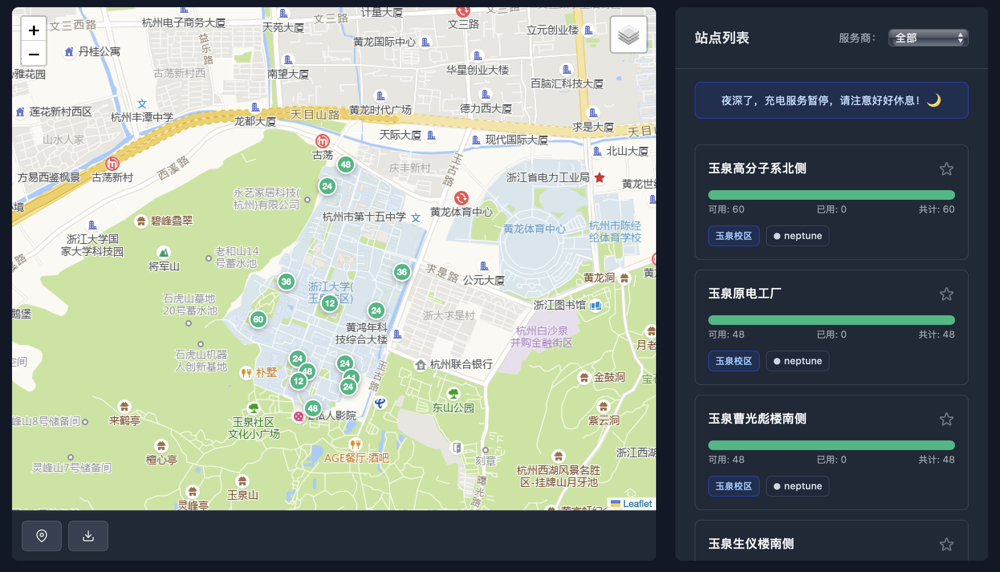
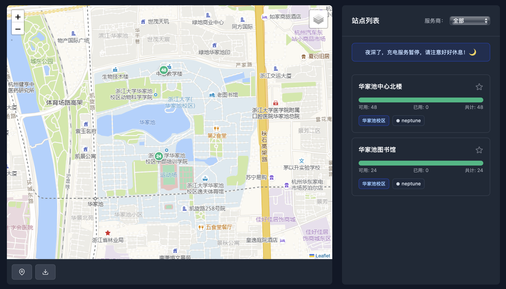
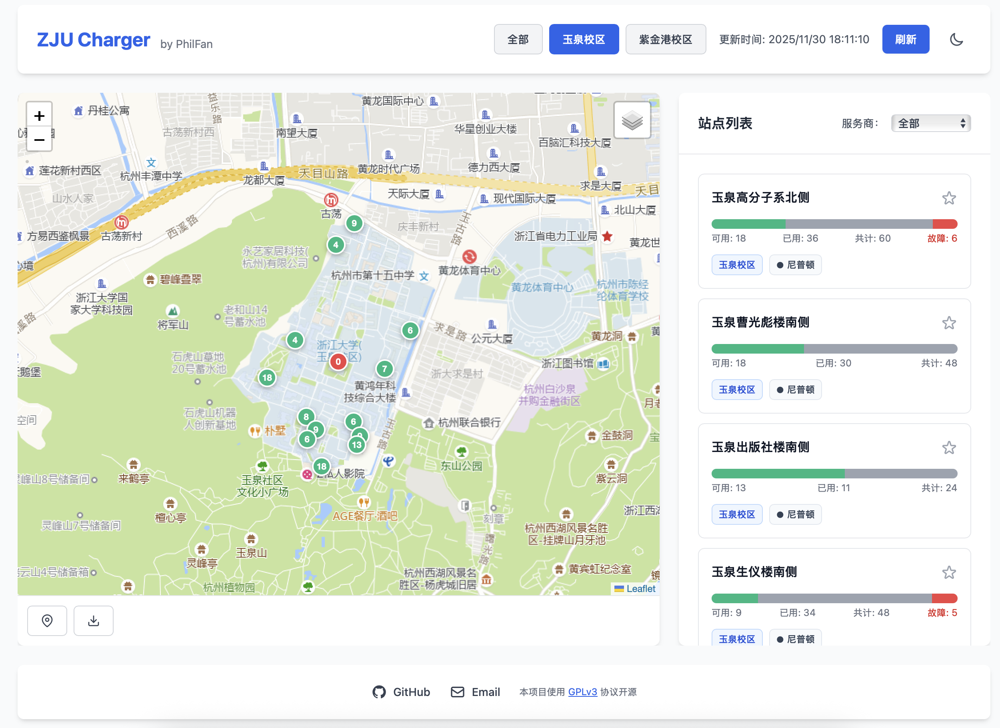
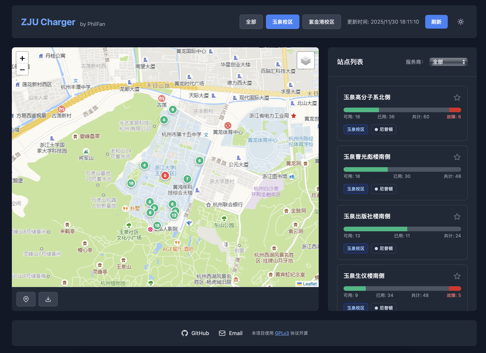
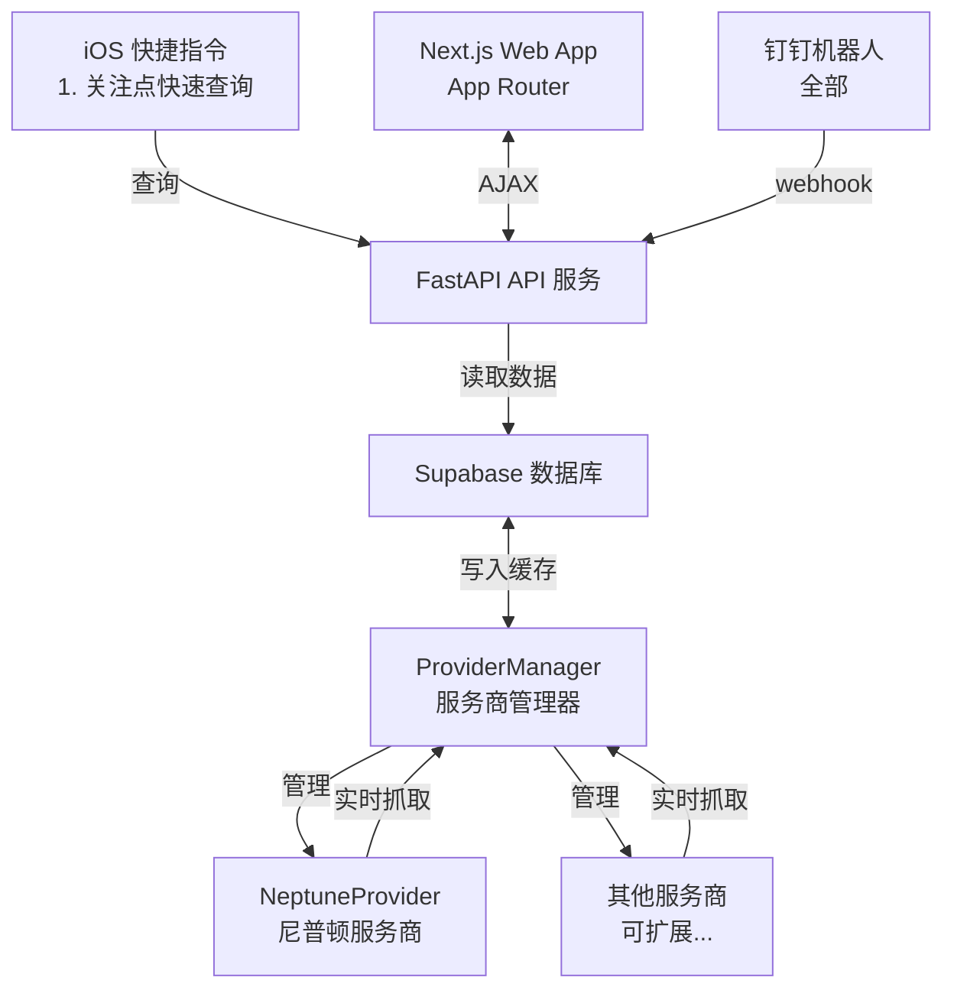

#  𝐙𝐉𝐔 𝐂𝐡𝐚𝐫𝐠𝐞𝐫

      

[](https://github.com/Phil-Fan/ZJU-Charger/actions/workflows/markdown-check.yml) [](https://github.com/Phil-Fan/ZJU-Charger/actions/workflows/python-check.yml) [](https://github.com/Phil-Fan/ZJU-Charger/actions/workflows/pages/pages-build-deployment)


你是否也曾骑着没电的小龟，慢吞吞地骑到充电桩，却发现一个空余的桩位都没有？😫
你是否也曾被充电桩服务商离谱的 UI 界面与复杂的查询接口所困扰？😠

ZJU Charger 基于 FastAPI 开发，瞄准**校内充电桩不好找、供应商入口不一、使用状态查询不便**三大痛点，为你提供一个简洁、易用、扩展性强的充电桩查询方案。

目前支持网站在线分校区、分服务商查询（普查）、iOS 快捷指令查询特定站点状态（精准查）、钉钉 Webhook 机器人等功能。

访问 [https://charger.philfan.cn/](https://charger.philfan.cn/) 查看效果。

> **免责声明**：本项目仅用于学习交流，不得用于商业盈利与非法用途。使用本项目所造成的任何后果，由使用者自行承担，作者不承担任何责任。请遵守相关法律法规。

## News

- 2025.12.02 - 重构前端 UI 支持尼普顿智慧生活公众号查询
- 2025.11.30 - GitHub 达到 50 Star，感谢支持！[校内公众号宣传贴](https://mp.weixin.qq.com/s/8tX1yHx_uvv64XQashPpTA)
- 2025.12.01 - 支持 iOS 快捷指令，增加华家池校区 [CC98 宣传贴](https://www.cc98.org/topic/6359446)（十大）
- 2025.11.29 - 完成后端页面开发，网站上线 [CC98 宣传贴](https://www.cc98.org/topic/6357576)（十大第一）
- 2025.11.28 - 发现脚本，制作可视化 [CC98 宣传贴](https://www.cc98.org/topic/6357005)

## 功能特性

### 前端功能

Next.js 框架开发：App Router + TypeScript + shadcn/ui, 开源在 [Phil-Fan/zju-charger-frontend](https://github.com/Phil-Fan/zju-charger-frontend) 这个仓库。

- [x] Apache ECharts + `echarts-extension-amap` 提供高德地图服务。
- [x] 支持三校区地图切换/服务商筛选。。
  
  
  
- [x] 绿/橙/红三色编码空闲、紧张、故障状态。
- [x] 双击站点打开导航卡片，支持高德地图和系统地图。
  
- [x] 支持实时定位，开启后持续追踪浏览器坐标、绘制用户标记。
- [x] 关注列表通过 localStorage 实现。
  
- [x] 界面与地图同时支持暗黑模式。
  
  
- [x] 前端定时自动刷新。
- [x] 夜间提示。

### 后端功能

- [x] FastAPI 统一 API 接口，使用 slowapi 实现接口限流功能
- [x] 多服务商架构支持，可同时异步抓取多个服务商的充电桩数据（目前支持了尼普顿服务商）
- [x] 后台定时抓取任务，自动更新缓存
- [x] Supabase 数据库支持，记录历史使用情况数据（可选）

### 快捷指令

[ZJU Charger.shortcut](https://www.icloud.com/shortcuts/1545aeee457046dbacba42ef0ab6285d)

支持快速查询关注的几个站点的状态，并可以添加到主屏幕，方便随时查看。
操作步骤详见 [Script 快捷指令文档](./docs/06-script-shortcuts.md#使用方法)。


### 钉钉 Webhook 机器人


## 文档

详细的文档请查看 [docs](./docs/) 目录：

- [快速开始](./docs/01-quick-start.md) - 快速上手指南
- [Web 介绍与部署](./docs/02-web-deployment.md) - 前端功能说明和部署指南
- [Server 端部署](./docs/03-server-deployment.md) - 后端服务器部署指南
- [Fetcher 文档](./docs/04-fetcher.md) - 如何添加新服务商、更新站点信息
- [钉钉机器人文档](./docs/05-dingbot.md) - 钉钉机器人配置和使用
- [Script 快捷指令文档](./docs/06-script-shortcuts.md) - iOS 快捷指令使用指南
- [Supabase 数据库架构](./docs/07-supabase-schema.md) - Supabase 数据库表结构和使用说明
- [API 参考](./docs/08-api.md) - 后端 REST API 描述与示例

### 系统架构

在开发层面，目标实现高内聚、低耦合、易于扩展。



所有查询来源（React Web SPA、钉钉、GitHub Action）都调用统一 API 和 ProviderManager，逻辑完全不重复。

前端通过 Vite 构建的 React + Apache ECharts-on-AMap 客户端消费这些 API，系统则保持多服务商架构以支持并发筛选。

### 项目结构

```text
project/
├── fetcher/
│   ├── provider_manager.py   # 服务商管理器
│   ├── providers/
│   │   ├── provider_base.py  # 服务商抽象基类
│   │   └── neptune.py        # 尼普顿服务商实现
│   └── station.py            # 共享 Station 模型（CSV 解析 + hash 生成）
├── db/
│   ├── client.py             # Supabase 客户端初始化
│   ├── station_repo.py       # stations 表 CRUD
│   ├── usage_repo.py         # latest/usage 表读写
│   ├── pipeline.py           # record_usage_data 数据管道
│   └── __init__.py           # 统一暴露 initialize/get/batch 接口
├── server/
│   ├── api.py                # FastAPI 主服务（直接调用 db/ 仓库）
│   ├── config.py             # 环境变量配置（支持服务商配置）
│   ├── run_server.py         # 服务器启动脚本
│   └── logging_config.py     # 日志配置
├── ding/
│   ├── bot.py                # 钉钉机器人封装
│   ├── webhook.py            # 钉钉 webhook 路由
│   └── commands.py           # 命令解析和执行
├── frontend/                 # Next.js + shadcn 前端
│   ├── package.json          # pnpm scripts、依赖、biome 配置
│   ├── src/app/              # Next App Router 页面、layout、错误页
│   ├── src/components/       # shadcn ui + 业务组件（Header/Map/List 等）
│   └── src/lib|hooks|types   # 校区配置、API 客户端、状态 hooks、坐标工具
├── script/                   # iOS 快捷指令
│   ├── README.md             # 快捷指令使用说明
│   └── *.shortcut            # 快捷指令文件
├── serve.sh                  # 快速启动脚本（基于 uv 同步依赖并调用 server.run_server）
├── pyproject.toml            # Python 依赖声明 + uv/Ruff 配置
└── uv.lock                   # uv 生成的锁定文件
```

## 许可证

使用 GPLv3 许可证，见 [LICENSE](./LICENSE) 文件

## 贡献

欢迎提交 Issue 和 Pull Request！

请查看：

- [行为准则](./CODE_OF_CONDUCT.md)
- [贡献指南](./CONTRIBUTING.md)
- [Issue 模板](./.github/ISSUE_TEMPLATE/)
- [Pull Request 模板](./.github/pull_request_template.md)


## 致谢

### 后端

- 感谢 [cyc-987/Charge-in-ZJU: 浙大充电桩查询](https://github.com/cyc-987/Charge-in-ZJU) 的原作者 [@cyc-987](https://github.com/cyc-987)，为项目提供灵感；感谢 [紫金港充电桩地图 - CC98 论坛](https://www.cc98.org/topic/6348814) 中分享的 ZJG 充电地图；感谢 [浙江大学 E 校园电子地图平台](https://map.zju.edu.cn/index?locale=en_US) 中的部分充电桩点位信息。
- 使用 [经纬度查询定位 ｜ 坐标拾取](https://www.mapchaxun.cn/Regeo) 调整抓取到的错误站点坐标。
- 使用 [fastapi](https://fastapi.tiangolo.com/) 实现 API 服务；使用 [slowapi](https://github.com/sunhailin-dev/slowapi) 实现接口限流功能。
- 使用 [supabase](https://supabase.com/) 实现数据库功能。
- 使用 [Caddy](https://caddyserver.com/) 实现 HTTPS 证书与反向代理服务。

### 前端

- 使用 [Next.js](https://nextjs.org/) 实现前端框架。
- 使用 [高德地图 Web JS SDK](https://console.amap.com/dev/index) 实现地图渲染。
- 使用 [Apache ECharts](https://echarts.apache.org/) + [echarts-extension-amap](https://github.com/plainheart/echarts-extension-amap) 完成地图渲染。
- 使用 [Apple URL Scheme - Map Links](https://developer.apple.com/library/archive/featuredarticles/iPhoneURLScheme_Reference/MapLinks/MapLinks.html) 与 [高德地图手机版 API - 路径规划](https://lbs.amap.com/api/amap-mobile/guide/android/navigation) 实现地图跳转。
- 使用 [shadcn/ui](https://ui.shadcn.com/) 实现组件库，使用 [tweakcn](https://tweakcn.com/editor/theme) 生成 Supabase 主题。
- 使用 [Biome](https://biomejs.dev/) 实现代码检查与格式化。
- 坐标转换由自定义 `geo` 工具实现（WGS84 ↔ GCJ02 ↔ BD09）。

### 其他

- 特别鸣谢 [@qychen2001](https://github.com/qychen2001) 对项目的大力支持！
- 使用 [minima](https://github.com/jekyll/minima) 主题生成项目文档。
- 使用 [huacnlee/autocorrect](https://github.com/huacnlee/autocorrect/), [DavidAnson/markdownlint-cli2-action](https://github.com/DavidAnson/markdownlint-cli2-action) 与 [gaurav-nelson/github-action-markdown-link-check](https://github.com/gaurav-nelson/github-action-markdown-link-check) 对 Markdown 文档进行自动化检查。
- 使用 [uv](https://docs.astral.sh/uv/) 管理 Python 依赖，并以 [Ruff](https://docs.astral.sh/ruff/) 统一完成格式化与 Lint（CI 通过 [astral-sh/ruff-action](https://github.com/astral-sh/ruff-action) 并行执行 `ruff format --check` 与 `ruff check`）。
- 使用 [jitter.video](https://jitter.video/templates) 实现 GIF 动画。
- 使用 [Star History](https://star-history.com/) 实现 star 历史统计。
- 使用 [Google analytics](https://analytics.google.com/) 和 [Clarity](https://clarity.microsoft.com/) 实现网站访问统计与用户理解。
- 使用 [Aliyun ECS](https://www.aliyun.com/product/ecs) 实现服务器部署，也使用了 [Vercel](https://vercel.com/) 与 [Cloudflare Pages](https://pages.cloudflare.com/) 实现静态网站部署。

感谢所有贡献者！


