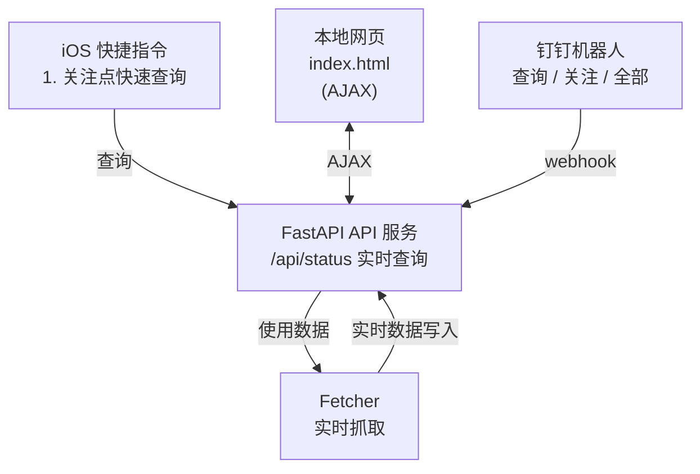

# ZJU Charger

> 基于 FastAPI 的浙江大学充电桩状态查询系统，根据尼普顿提供的 API 接口，实现充电桩状态查询、关注列表、钉钉机器人交互等功能。

免责声明：本项目仅用于个人学习交流，不得用于商业用途。使用本项目所造成的任何后果，由使用者自行承担。

## 系统架构



所有查询来源（网页、钉钉、GitHub Action）都调用统一 API 和 Fetcher，逻辑完全不重复。

## 功能特性

- [x] 异步并发抓取，大幅提升查询速度
- [x] FastAPI 统一 API 接口
- [x] 网页地图可视化（Leaflet）
- [x] 支持高德地图、OpenStreetMap 三种地图
- [ ] 使用 ChinaTMSProviders 插件，支持多种地图
- [ ] 钉钉机器人交互（查询/关注/全部）
- [ ] GitHub Action 自动定时抓取
- [ ] GitHub Pages 静态部署支持


## 项目结构

```text
project/
├── fetcher/
│   └── fetch.py          # 统一抓取逻辑（异步）
├── server/
│   ├── api.py            # FastAPI 主服务
│   ├── storage.py        # 数据存储管理
│   └── config.py         # 环境变量配置
├── ding/
│   ├── bot.py            # 钉钉机器人封装
│   ├── webhook.py        # 钉钉 webhook 路由
│   └── commands.py       # 命令解析和执行
├── web/                  # 前端文件
│   ├── index.html        # 地图 + 列表页面
│   ├── script.js         # 前端逻辑
│   └── style.css         # 样式文件
├── data/                 # 数据目录
│   ├── latest.json       # 最新状态缓存
│   └── watchlist.json    # 用户关注列表
├── script/               # iOS 快捷指令
│   ├── README.md         # 快捷指令使用说明
│   └── *.shortcut        # 快捷指令文件
├── main.py               # 独立运行脚本（向后兼容）
└── requirements.txt      # 依赖库
```

## 快速开始

### 1. 安装依赖

```bash
pip install -r requirements.txt
```

### 2. 抓取 OpenID

为了识别用户，每个用户针对每个公众号或小程序等应用会产生一个安全的 OpenID

- 在小程序中，openID 是小程序的普通用户的一个唯一的标识，只针对当前的小程序有效
- 同理在公众号中 openID 是公众号的普通用户的一个唯一的标识，只针对当前的公众号有效

下面以 iOS 系统为例，展示如何抓取 OpenID。

1. 下载[Stream](https://apps.apple.com/us/app/stream/id1312141691?l=zh-Hans-CN)
2. 打开 Stream，点击开始抓包
3. 进入尼普顿小程序，点击充电桩服务 - 附近
4. 回到 Stream，点击结束抓包
5. 点击抓包历史，找到尼普顿小程序的请求，点击请求头，找到 openid 参数
6. 复制 openid 参数值，即为 OpenID

### 3. 配置环境变量

编辑 `.env` 文件：

```env
# 微信 openId（必需）
OPENID=your_openid_here

# 钉钉机器人配置（可选）
DINGTALK_WEBHOOK=https://oapi.dingtalk.com/robot/send?access_token=xxx
DINGTALK_SECRET=your_secret_here

# API 服务器配置
API_HOST=0.0.0.0 # 服务器地址
API_PORT=8000 # 服务器端口
```

参数获取方法：通过抓包获取微信小程序中的请求参数。

### 4. 更新站点信息（可选）

站点信息存储在 `data/stations.json` 中。首次运行或需要更新站点信息时，运行：

```bash
python server/update_stations.py
```

**注意**：服务器启动时不会自动更新站点信息，需要手动运行此脚本。

### 5. 运行服务器（前后端一体）

```bash
python run_server.py
```

访问 `http://localhost:8000/web/` 查看效果

### 6. 快速查询关注列表站点状态

如果只想查询关注列表站点状态，也可以运行：

```bash
python quick_query.py
```

实现命令行查询关注列表站点状态。

### Docker 部署（TODO: 待实现）

## 许可证

见 LICENSE 文件

## 贡献

欢迎提交 Issue 和 Pull Request！

## 致谢

- 感谢 [cyc-987/Charge-in-ZJU: 浙大充电桩查询](https://github.com/cyc-987/Charge-in-ZJU) 的原作者 [@cyc-987](https://github.com/cyc-987)，为该项目提供了基础功能和灵感。
- 使用 [leaflet-echarts](https://github.com/wandergis/leaflet-echarts) 提供了地图可视化功能。
- 使用 [wandergis/coordtransform](https://github.com/wandergis/coordtransform) 提供了百度坐标（BD09）、国测局坐标（火星坐标，GCJ02）、和 WGS84 坐标系之间的转换函数，解决坐标偏移的问题。
- 使用 [htoooth/Leaflet.ChineseTmsProviders](https://github.com/htoooth/Leaflet.ChineseTmsProviders/tree/master) 提供了多种地图支持。
- 使用 [Tailwind CSS](https://tailwindcss.com/) 样式库。
