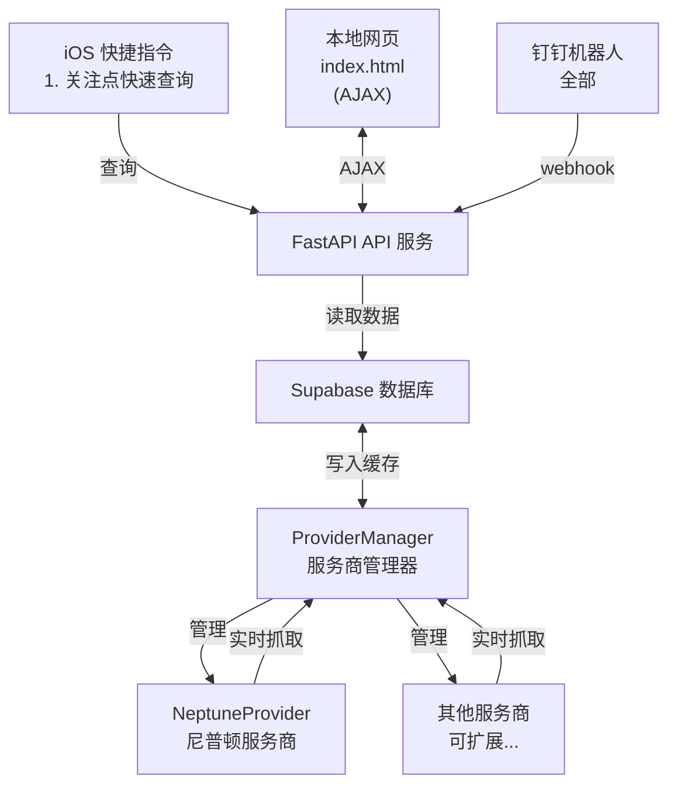

# ZJU Charger

      

[](https://github.com/Phil-Fan/ZJU-Charger/actions/workflows/markdown-check.yml) [](https://github.com/Phil-Fan/ZJU-Charger/actions/workflows/python-check.yml) [](https://github.com/Phil-Fan/ZJU-Charger/actions/workflows/pages/pages-build-deployment)

你是否也曾骑着没电的小龟，慢吞吞地骑到充电桩，却发现一个空余的桩位都没有？😫
你是否也曾被充电桩服务商离谱的 UI 界面与复杂的查询接口所困扰？😠

ZJU Charger 基于 FastAPI 开发，瞄准**校内充电桩不好找、供应商入口不一、使用状态查询不便**三大痛点，为你提供一个简洁、易用、扩展性强的充电桩查询方案。

目前支持网站在线分校区、分服务商查询（普查）、iOS 快捷指令查询特定站点状态（精准查）、钉钉 Webhook 机器人等功能。

访问 [https://charger.philfan.cn/](https://charger.philfan.cn/web/) 查看效果。

> **免责声明**：本项目仅用于学习交流，不得用于商业盈利与非法用途。使用本项目所造成的任何后果，由使用者自行承担，作者不承担任何责任。请遵守相关法律法规。

## 功能特性

### 前端功能

- [x] 网页地图可视化（Leaflet），站点列表按照可用数量进行排序
- [x] 按照可用数量进行颜色区分，绿色表示有空闲，橙色表示紧张，红色表示无空闲
- [x] 前端关注列表功能：关注的站点显示在站点的最上方
- [x] 可以显示当前位置（需用户授权地理位置权限）
- [x] 支持服务商筛选功能（前端下拉框）
- [x] 支持校区筛选功能（玉泉、紫金港）
- [x] 支持高德地图、OpenStreetMap、腾讯地图地图后端
- [x] 支持地图下载功能
- [x] 支持夜间模式（按钮切换深色/浅色模式）


### 后端功能

- [x] 后台定时抓取任务，自动更新缓存
- [x] Supabase 数据库支持，记录历史使用情况数据（可选）
- [x] FastAPI 统一 API 接口，使用 slowapi 实现接口限流功能
- [x] 多服务商架构支持，可同时异步抓取多个服务商的充电桩数据（目前支持了尼普顿服务商）

### 快捷指令

[ZJU Charger.shortcut](https://www.icloud.com/shortcuts/1545aeee457046dbacba42ef0ab6285d)

支持快速查询关注的几个站点的状态，并可以添加到主屏幕，方便随时查看。
操作步骤详见 [Script 快捷指令文档](./docs/06-script-shortcuts.md#使用方法)。


### 钉钉 Webhook 机器人


## 文档

详细的文档请查看 [docs](./docs/) 目录：

- [快速开始](./docs/01-quick-start.md) - 快速上手指南
- [Web 介绍与部署](./docs/02-web-deployment.md) - 前端功能说明和部署指南
- [Server 端部署](./docs/03-server-deployment.md) - 后端服务器部署指南
- [Fetcher 文档](./docs/04-fetcher.md) - 如何添加新服务商、更新站点信息
- [钉钉机器人文档](./docs/05-dingbot.md) - 钉钉机器人配置和使用
- [Script 快捷指令文档](./docs/06-script-shortcuts.md) - iOS 快捷指令使用指南
- [Supabase 数据库架构](./docs/07-supabase-schema.md) - Supabase 数据库表结构和使用说明
- [API 参考](./docs/08-api.md) - 后端 REST API 描述与示例

## 最小抓取示例

可以使用 `fetcher/minium_get_status.py` 进行简单的状态查询：

```shell
python fetcher/minium_get_status.py --address 50359163
```

或者直接使用 API 接口：

```shell
curl http://localhost:8000/api/status?id=29e30f45
```

## 系统架构

在开发层面，目标实现高内聚、低耦合、易于扩展。



所有查询来源（网页、钉钉、GitHub Action）都调用统一 API 和 ProviderManager，逻辑完全不重复。系统采用多服务商架构，支持同时显示和筛选多个服务商的充电桩数据。

## 项目结构

```text
project/
├── fetcher/
│   ├── provider_manager.py   # 服务商管理器
│   ├── providers/
│   │   ├── provider_base.py  # 服务商抽象基类
│   │   └── neptune.py        # 尼普顿服务商实现
│   └── station.py            # 共享 Station 模型（CSV 解析 + hash 生成）
├── db/
│   ├── client.py             # Supabase 客户端初始化
│   ├── station_repo.py       # stations 表 CRUD
│   ├── usage_repo.py         # latest/usage 表读写
│   ├── pipeline.py           # record_usage_data 数据管道
│   └── __init__.py           # 统一暴露 initialize/get/batch 接口
├── server/
│   ├── api.py                # FastAPI 主服务（直接调用 db/ 仓库）
│   ├── config.py             # 环境变量配置（支持服务商配置）
│   └── logging_config.py     # 日志配置
├── ding/
│   ├── bot.py                # 钉钉机器人封装
│   ├── webhook.py            # 钉钉 webhook 路由
│   └── commands.py           # 命令解析和执行
├── web/                      # 前端文件
│   ├── index.html            # 地图 + 列表页面（支持服务商筛选）
│   ├── script.js             # 前端逻辑（支持多服务商）
│   └── style.css             # 样式文件
├── script/                   # iOS 快捷指令
│   ├── README.md             # 快捷指令使用说明
│   └── *.shortcut            # 快捷指令文件
├── run_server.py             # 服务器启动脚本
├── serve.sh                  # 快速启动脚本（自动安装依赖）
└── requirements.txt          # 依赖库
```

## 许可证

使用 GPLv3 许可证，见 [LICENSE](./LICENSE) 文件

## 贡献

欢迎提交 Issue 和 Pull Request！

请查看：

- [行为准则](./CODE_OF_CONDUCT.md)
- [贡献指南](./CONTRIBUTING.md)
- [Issue 模板](./.github/ISSUE_TEMPLATE/)
- [Pull Request 模板](./.github/pull_request_template.md)


## 致谢

### 后端

- 感谢 [cyc-987/Charge-in-ZJU: 浙大充电桩查询](https://github.com/cyc-987/Charge-in-ZJU) 的原作者 [@cyc-987](https://github.com/cyc-987)，为项目提供灵感；感谢 [紫金港充电桩地图 - CC98 论坛](https://www.cc98.org/topic/6348814) 中分享的 ZJG 充电地图；感谢 [浙江大学 E 校园电子地图平台](https://map.zju.edu.cn/index?locale=en_US) 中的部分充电桩点位信息。
- 使用 [经纬度查询定位 ｜ 坐标拾取](https://www.mapchaxun.cn/Regeo) 调整抓取到的错误站点坐标。
- 使用 [fastapi](https://fastapi.tiangolo.com/) 实现 API 服务；使用 [slowapi](https://github.com/sunhailin-dev/slowapi) 实现接口限流功能。
- 使用 [supabase](https://supabase.com/) 实现数据库功能。
- 使用 [Caddy](https://caddyserver.com/) 实现 HTTPS 证书与反向代理服务。

### 前端

- 使用 [leaflet-echarts](https://github.com/wandergis/leaflet-echarts) 实现地图可视化功能。
- 使用 [Leaflet.EasyPrint](https://github.com/rowanwins/leaflet-easyPrint) 插件实现地图下载功能。
- 使用 [wandergis/coordtransform](https://github.com/wandergis/coordtransform) 实现百度坐标（BD09）、国测局坐标（火星坐标，GCJ02）、和 WGS84 坐标系之间的转换函数，解决坐标偏移的问题。
- 使用 [htoooth/Leaflet.ChineseTmsProviders](https://github.com/htoooth/Leaflet.ChineseTmsProviders/tree/master) 实现多种地图支持。
- 使用 [Tailwind CSS](https://tailwindcss.com/) 样式库。

### 其他

- 使用 [minima](https://github.com/jekyll/minima) 主题生成项目文档。
- 使用 [huacnlee/autocorrect](https://github.com/huacnlee/autocorrect/), [DavidAnson/markdownlint-cli2-action](https://github.com/DavidAnson/markdownlint-cli2-action) 与 [gaurav-nelson/github-action-markdown-link-check](https://github.com/gaurav-nelson/github-action-markdown-link-check) 对 Markdown 文档进行自动化检查。
- 使用 [black](https://github.com/psf/black) 与 [lgeiger/black-action](https://github.com/lgeiger/black-action) 对 Python 代码进行自动化格式检查。
- 使用 [Star History](https://star-history.com/) 实现 star 历史统计。

感谢所有贡献者！


